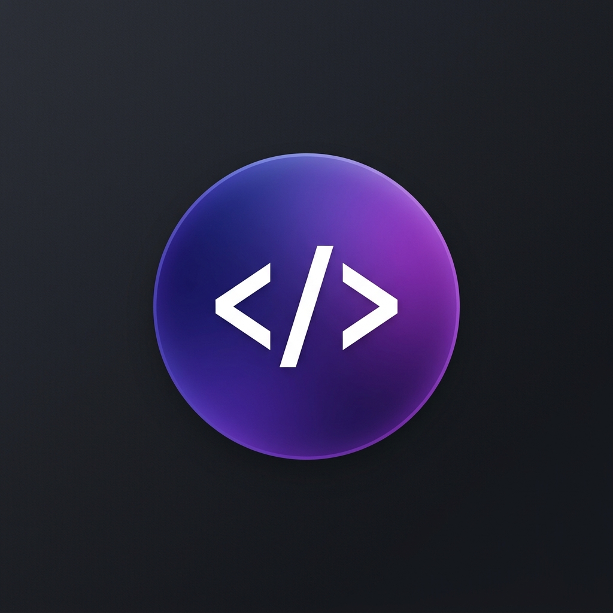

# ✨ Modern Portfolio - Django

A premium, high-performance developer portfolio built with **Django**, featuring a sleek **Glassmorphism** design, animated background effects, and a custom administrative dashboard.



## 🚀 Features

- **💎 Modern UI:** Dark-themed aesthetic with glassmorphism, floating animations, and scroll-reveal effects.
- **📱 Fully Responsive:** Optimized for all screen sizes, from mobile to ultra-wide monitors.
- **🛠️ Admin Dashboard:** Custom management interface to update your profile, projects, skills, and experience without touching the code.
- **✉️ Contact System:** Integrated contact form with database logging and email notifications.
- **☁️ Production Ready:** Optimized for deployment on Render or Vercel with persistent storage support.
- **🖼️ Persistent Images:** Integrated with Cloudinary for reliable image hosting in serverless environments.

## 🛠️ Tech Stack

- **Backend:** Django 6.0+
- **Database:** PostgreSQL (Production) / SQLite (Development)
- **Storage:** Cloudinary (Media) / WhiteNoise (Static)
- **Frontend:** HTML5, Vanilla CSS, JavaScript (Inter Font, FontAwesome)
- **Deployment:** Render / Vercel

## 📦 Installation & Local Setup

1. **Clone the repository:**
   ```bash
   git clone https://github.com/Adbuthj/portfolio1.git
   cd portfolio1
   ```

2. **Create and activate a virtual environment:**
   ```bash
   python -m venv venv
   source venv/bin/activate  # On Windows: venv\Scripts\activate
   ```

3. **Install dependencies:**
   ```bash
   pip install -r requirements.txt
   ```

4. **Run migrations:**
   ```bash
   python manage.py migrate
   ```

5. **Start the development server:**
   ```bash
   python manage.py runserver
   ```
   Visit `http://127.0.0.1:8000` to see your site!

## 🌐 Deployment Guide

### Environment Variables
To ensure the site works correctly in production, add the following environment variables to your hosting provider (Render/Vercel):

| Variable | Description |
|----------|-------------|
| `SECRET_KEY` | Your Django secret key |
| `DEBUG` | Set to `False` in production |
| `DATABASE_URL` | Your PostgreSQL connection string |
| `CLOUDINARY_CLOUD_NAME` | Your Cloudinary Cloud Name |
| `CLOUDINARY_API_KEY` | Your Cloudinary API Key |
| `CLOUDINARY_API_SECRET` | Your Cloudinary API Secret |

### Deploying to Render
1. Connect your GitHub repository to Render.
2. Render will automatically detect the `render.yaml` and `build.sh` files.
3. It will provision a PostgreSQL database and a Web Service for you.

### Deploying to Vercel
1. Connect your GitHub repository to Vercel.
2. Vercel will use the `vercel.json` configuration.
3. Ensure you have connected an external PostgreSQL database and added the `DATABASE_URL`.

## 📄 License

This project is open-source and available for personal use.

---
Built with ❤️ by [Your Name]
